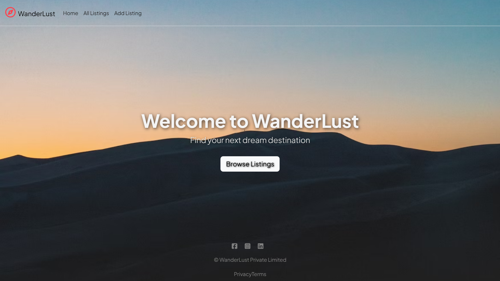
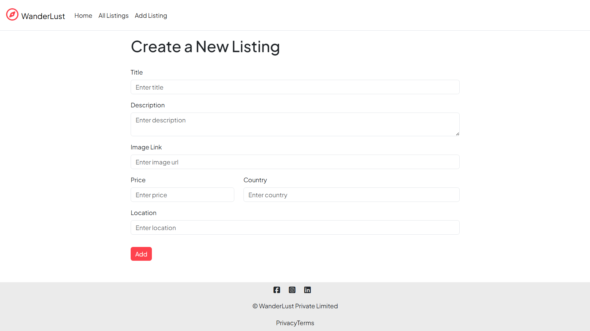

# 🌍 WanderLust

**WanderLust** is a full-stack travel listing web application where users can create, explore, and manage beautiful vacation listings.

---

## 🛠 Tech Stack

- **Node.js**
- **Express**
- **MongoDB**
- **Mongoose**
- **EJS Templating**
- **Bootstrap 5**
- **Cloudinary (Image Uploads)**
- **Multer (File Handling)**

---

## ✨ Features

- 🧳 Add new travel listings
- ✏️ Edit / Delete listings
- 🖼️ Upload images to Cloudinary
- 🔎 Explore listings with responsive UI
- 🗃️ MongoDB data storage
- 📎 Clean & intuitive interface

---

## 📸 Screenshots

*(Insert screenshots here using the format below)*

### 🏠 Home Page

### ➕ Create Listing

### 📝 Listing Details
